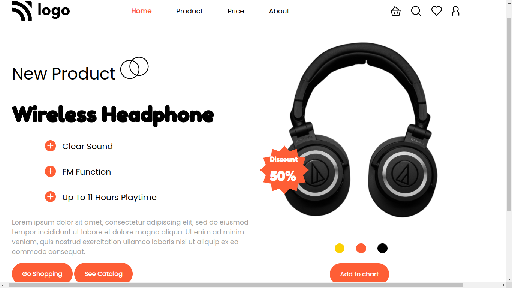

# Assignment 7
## Full Stack Javascript Web Development Course by [iNeuron](https://ineuron.ai/)

This webpage is created with core HTML & CSS. This is a responsive webpage and I have used Media query to give responsiveness. It took me almost 4 to 5 hours to complete the webpage. I'm giving 2 screenshots of the webpage below.

[Click Here](https://fsjs-assignment7.netlify.app/) to view the website.

## **Screenshots of the web-page in large screen:**

## **Screenshots of the web-page in smaller screen:**

## Contact me: [Linkedin](https://www.linkedin.com/in/subham-dutta-8670b8178/) | [Github](https://github.com/Sduttt) | [Twitter](https://twitter.com/Subhamd88404337) | [Facebook](https://www.facebook.com/profile.php?id=100073951804006) | [Instagram](https://www.instagram.com/its_subham_dutta/)

## Find me on [Findcoder.io](https://www.findcoder.io/u/sdutta)
